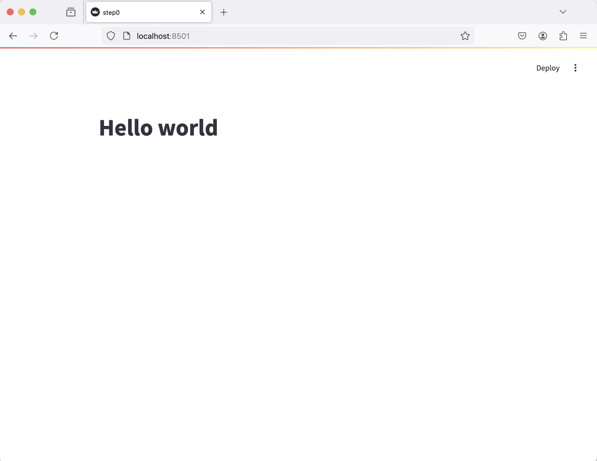
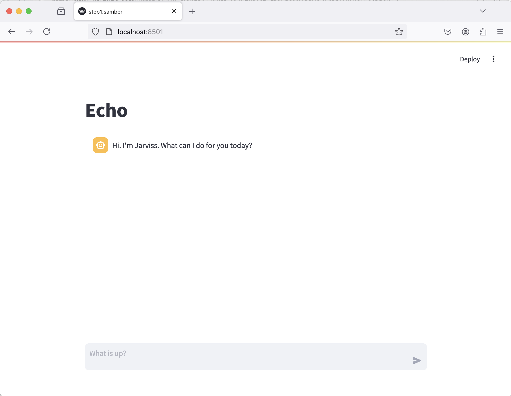
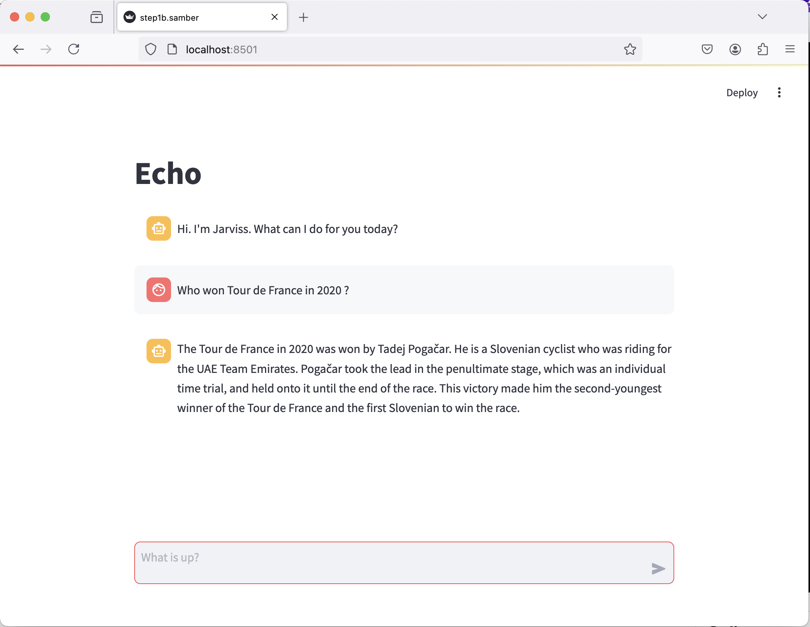
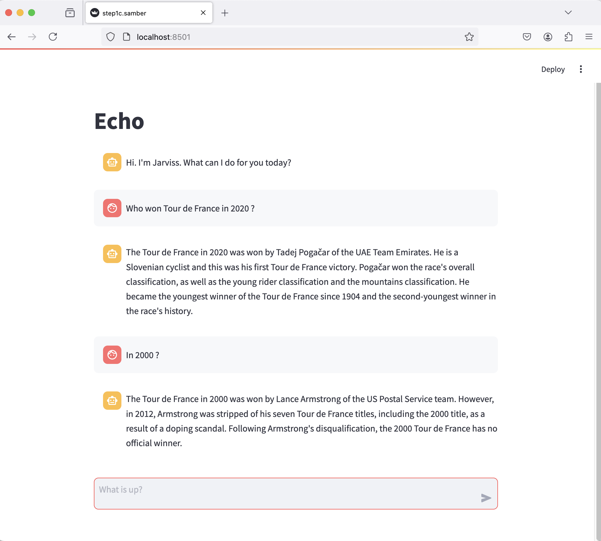
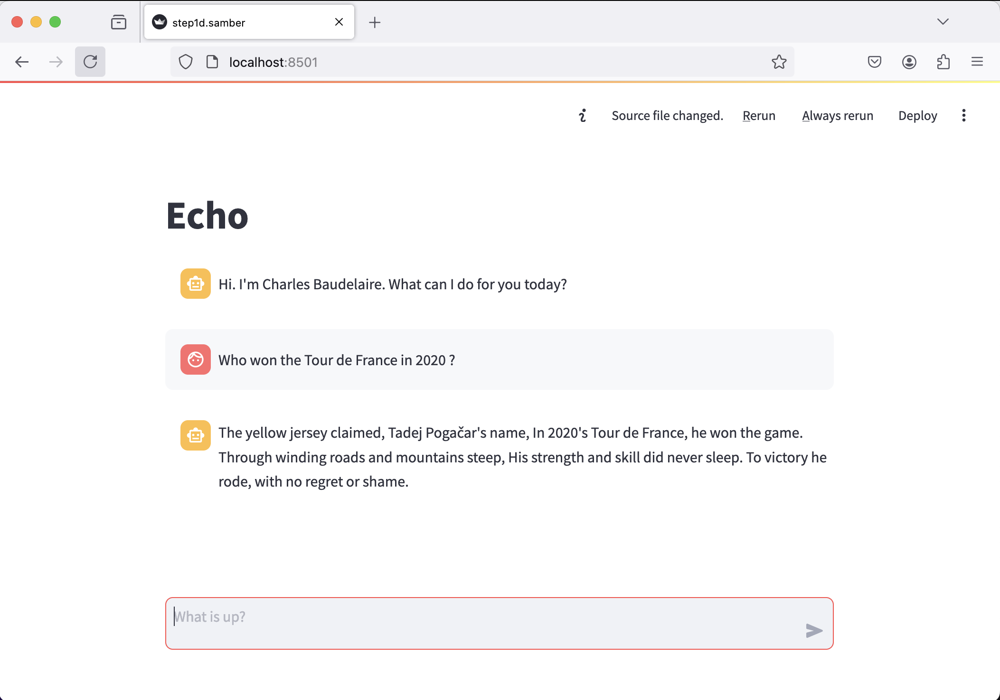
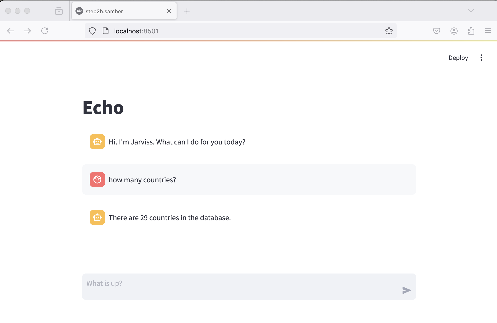
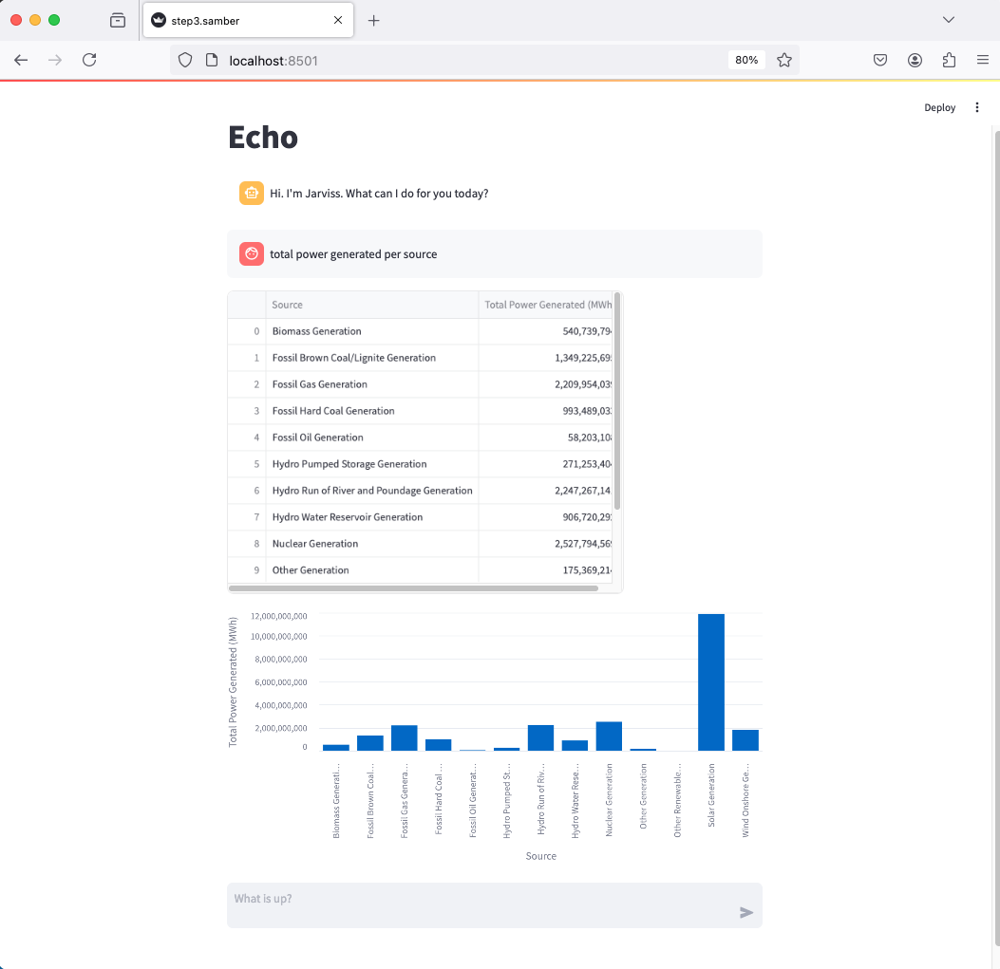

# Workshop Streamlit + Langchain

## Intro

During this workshop, you will learn how to create an LLM-powered chat that connects to a corporate database and builds reporting.

## Step 0 - Setup your environment

First, fork this repository!

You can either run your app locally or use a free [Github codespace](https://github.com/features/codespaces).

Requirements:
- python
- pip

Python libs:
- streamlit
- openai
- langchain
- langchain-community
- matplotlib
- pandas

A shortcut for non-pythonista:

```bash
# install
python -m venv venv 
source ./venv/bin/activate
pip install -r requirements
```

```bash
# run
export OPENAI_API_KEY=sk-ZsfWSRv1LAU2jlOXgMQBT3BlbkFJodduSZ2U44nNlex
streamlit run step0.py
```

When starting the Streamlit step0.py app, your browser will open a page displaying a simple "Hello world".



## Step 1 - LLM-driven chat

The `step1.py` app contains a simple "echo" chat. Your mission, if you accept it, is to connect Streamlit to OpenAI and build a ChatGPT-like app.

### A - Welcome

Your app should introduce itself and display instructions.



### B - Connect OpenAI

Currently, your bot is repeating your question. Now, install the OpenAI python library and use the user prompt to generate LLM-powered answers.

💡 OpenAI python lib: https://pypi.org/project/openai/

💡 OpenAI python doc: https://github.com/openai/openai-python



### C - Conversation

At present, your chatbot is unable to keep track of previous questions and answers, making each question independent of the previous one.

Improve your current Streamlit script to send the full conversation at each user entry.



### D - Jarviss turned into Baudelaire

It would be very fun to reply to the user with the prose of a poet. Add a system prompt for this conversation: `Be concise, and reply like a poet.`.



## Step 2 - SQL agent

In this repository, you will find a Sqlite database `power-generation.sqlite`, containing time-series about the European power generation, per country and energy source.

Here is the schema of the `power_generation` table:

```bash
$ sqlite3 power-generation.sqlite 

sqlite> .tables
power_generation

sqlite> .schema power_generation 
CREATE TABLE power_generation (
        id INTEGER PRIMARY KEY,
        timestamp INTEGER NOT NULL, 
        country text NOT NULL, 
        biomass_generation_mwh INTEGER DEFAULT 0,
        fossil_brown_coal_lignite_generation_mwh INTEGER DEFAULT 0,
        fossil_gas_generation_mwh INTEGER DEFAULT 0,
        fossil_hard_coal_generation_mwh INTEGER DEFAULT 0,
        fossil_oil_generation_mwh INTEGER DEFAULT 0,
        hydro_pumped_storage_generation_mwh INTEGER DEFAULT 0,
        hydro_run_of_river_and_poundage_generation_mwh INTEGER DEFAULT 0,
        hydro_water_reservoir_generation_mwh INTEGER DEFAULT 0,
        nuclear_generation_mwh INTEGER DEFAULT 0,
        other_generation_mwh INTEGER DEFAULT 0,
        other_renewable_generation_mwh INTEGER DEFAULT 0,
        solar_generation_mwh INTEGER DEFAULT 0,
        wind_onshore_generation INTEGER DEFAULT 0,
        fossil_coal_derived_gas_generation_mwh INTEGER DEFAULT 0,
        waste_generation_mwh INTEGER DEFAULT 0,
        wind_offshore_generation INTEGER DEFAULT 0,
        fossil_oil_shale_generation_mwh INTEGER DEFAULT 0,
        fossil_peat_generation_mwh INTEGER DEFAULT 0,
        geothermal_generation_mwh INTEGER DEFAULT 0,
        marine_generation_mwh INTEGER DEFAULT 0
    );
```

In step 2, we will use OpenAI and the Langchain framework to build a chat that interacts with this database.

### A - Create a simple SQL agent

Start with the `step2.py` script and use the default "SQL agent" provided by the Langchain framework.

Doc: https://python.langchain.com/v0.2/docs/integrations/toolkits/sql_database/

Warning: if you run this workshop against a production database, keep in mind that an LLM can write INSERT/UPDATE/DELETE/TRUNCATE/DROP queries 😅.

### B - SQL agent for Streamlit

Let's connect this SQL agent to your previous Streamlit app!



## Step 3 - Draw charts

Streamlit can embed charts in the chat. Depending on the user input, we will need to find the most appropriate chart.

Based on the user input, ask OpenAI what would be the best output format. Eg:

```python
template = """
Based on the following question, understand if the user has requested a line chart, a histogram, or none. Respond with only one of these options: histogram, line_chart, none.
Question: {question}
Response:"""

prompt = ChatPromptTemplate.from_template(template)
chain = (prompt | llm)
response = chain.invoke(template, {"question": question}).content
# returns either "histogram", "line_chart", "none"
```

Then, based on the answer, export the data to CSV using Pandas, and generate Streamlit chart.

Charts on Streamlit: https://docs.streamlit.io/develop/api-reference/charts



## Step 4 - Deploy!

Streamlit has a great tutorial to deploy a Streamlit app hosted on Github: https://docs.streamlit.io/deploy/streamlit-community-cloud

That's all folk'! ✌️
